# What is this?

This application allows you to simulate the visibility of up to fifteen different vehicles in a variety of position and camera configurations.

# How to run it?

Download the release build, extract, and execute.

# How does it work?

## Simulation Hierarchy

The simulation can be divided into a hierarchy made of five levels, each made up of the ones after:

### Simulation Run

The highest level, where the user provides the program with the parameters that it will use during the simulation. These include:

- The driving direction of the road.
- The type of vehicle used.
- The set of _Camera Positions_ that will be used to capture the information, along with the possible _Camera Directions_ that may be used at each.
- The positions that the _Target Vehicle_ may occupy. This is the vehicle that is being measured, where the visibility of the camera is projected on.
- The positions that the _Blocking Vehicles_ may occupy. These are other vehicles placed on the scene that do not record data, and only exist to block the view of the _Target Vehicle_ from the camera.
- The number of vehicles in the scenario, including the _Target Vehicle_ and _Blocking Vehicles_. There will always be one and only one _Target Vehicle_ in any given simulation. There may never be more _Blocking Vehicles_ in the road than there are positions for it.
- The minimum and maximum distance that a point on the _Target Vehicle_ may be from the camera for it to be recorded.

Based on these parameters, the software will instantiate a Target Vehicle in the pre-made environment, calculate all possible permutations of the _Target Vehicle_ and the _Blocking Vehicles_ in their possible positions, then cycle through each of these _Scenarios_ using the specified settings.

### Scenario

Represents a combination of different placements on the road for the _Target Vehicle_ and other _Blocking Vehicles_ on the road. Since we want to find the points of the _Target Vehicle_ that are visible the most often, we want to cycle through all possible combinations of _Blocking Vehicle_ placements to simulate the ways in which other vehicles on the road may block the view of the pedestrian.

### Camera Position

For each scenario, the camera will move through each of the _Camera Positions_ selected by the user. At each position, the camera's vertical position will be one of five different vertical distances from the floor: 1m, 1.2m, 1.4m, 1.6m, and 1.8m.

### Camera Direction

At each _Camera Position_, and each of the vertical distances of each, the camera will cycle through each of the directions selected for that _Camera Position_ and take a _Data Capture_.

### Data Capture

At each, the camera simulates a series of ray-casts in a grid pattern coming from the camera to replicate where it is observing the Target Vehicle. Each ray-cast starts at the minimum distance away from the camera, and ends at its maximum distance.

Ray-casting allows us to find the intersection point between an origin point (the camera) and a destination point (the point it sees), as well as the details of the first collider hit this way. We use this to record the points of the _Target Vehicle_ seen by the camera.

At any given time, one and only one of the vehicles currently in the environment may record the points where it is being observed by the recording camera, this is considered the _Target Vehicle_. In each Scenario, the rest of the spaces that are occupied by vehicles are all filled with Blocking Vehicles that use the same model as the Target Vehicle, but do not record any data.

# How to Use the Custom Road Simulation

The geometry of the scene for the simulation is static and non-changing. This is a top-down view of it:

You can change different parameters of the simulation you want to run, however. A custom simulation code is divided into 9 parts, separated by vertical bars, like this:

| SMALL,US\|Carryall\|S_1,S_2,S_3\|1\|Carryall\|S_1,S_2,S_3,S_4\|A-1,2;B-1,2,3\|0\|5 |     |     |     |     |     |     |     |     |
| --- |     |     |     |     |     |     |     |     | --- | --- | --- | --- | --- | --- | --- | --- |

| a   | b   | c   | d   | e   | f   | g   | h   | i   |
| --- | --- | --- | --- | --- | --- | --- | --- | --- |

Each part is written into a separate field of the simulation options, seen in the following pages.

##

## (a) Setup ID

Following the structure "\[Position Distance,\[Driving Direction\]". This part is divided into two elements by a comma:

### Position Distance

This determines the spacing between vehicle positions on the scene, as seen below. The available options are **SMALL**, **MEDIUM**, **LARGE**, and **XLARGE**. The spacing between positions is universal, and used by both the Target Vehicle and Blocking Vehicles, regardless of the vehicles used.

These are the size categories for each vehicle type. It is not recommended to select a Position Distance smaller than the size of the selected Target Vehicle or Blocking Vehicle model:

| **Category** | **Vehicle Type** |
| --- | --- |
| SMALL | Motorcycle |
| --- | --- |
| SMALL | Smart Car |
| --- | --- |
| SMALL | Carryall Car |
| --- | --- |
| MEDIUM | Sedan |
| --- | --- |
| MEDIUM | SUV |
| --- | --- |
| MEDIUM | Panel Van |
| --- | --- |
| MEDIUM | Topless Convertible |
| --- | --- |
| MEDIUM | Station Wagon |
| --- | --- |
| LARGE | Four wheel Truck |
| --- | --- |
| LARGE | Minibus |
| --- | --- |
| LARGE | Pickup Truck |
| --- | --- |
| LARGE | Moving Truck |
| --- | --- |
| XLARGE | Motor home |
| --- | --- |
| XLARGE | Double Decker Bus |
| --- | --- |
| XLARGE | Single Decker Bus |
| --- | --- |

### 

Driving Direction

This option is for selecting whether the vehicles are driving north on the right lane or the left lane. At the time of writing, the only available option is **US** for right-hand driving.

##

## (b) Target Vehicle Model

This lets you choose the 3D model of the vehicle used for the simulation, based on the type, by writing its keyword. Here is a list of every available vehicle type, the keyword to use it, and the vehicle it's based on:

### Motorcycle (**Motorcycle**)

Based on the Honda Shadow RS 2010

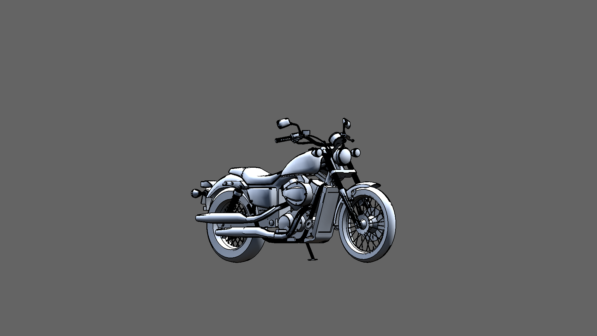

### Smart Car (**SmartCar**)

Based on the Smart Fortwo

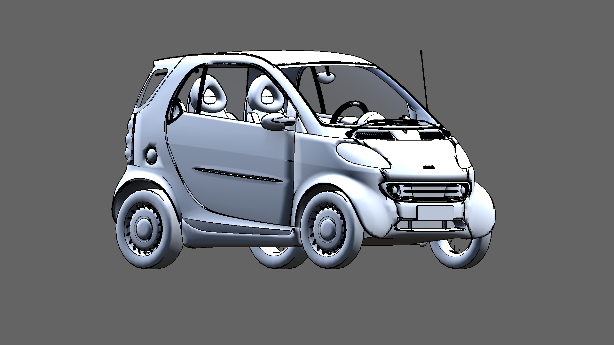

### Carryall Car (**Carryall**)

Designed as a generic golf cart. No specific model inspiration.

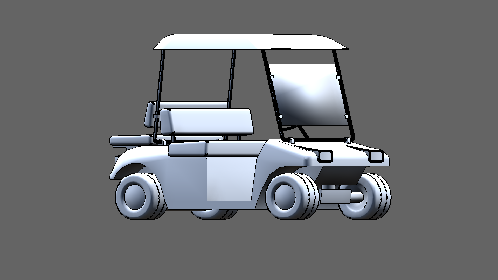

### Sedan (**Sedan**)

Made to look like Japanese and Korean sedans from the 2010s. No specific model inspiration.

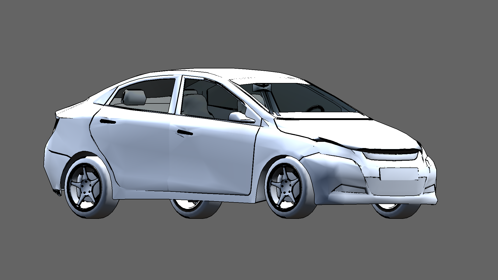

### SUV (**SUV**)

Based on the Ford Edge 2006

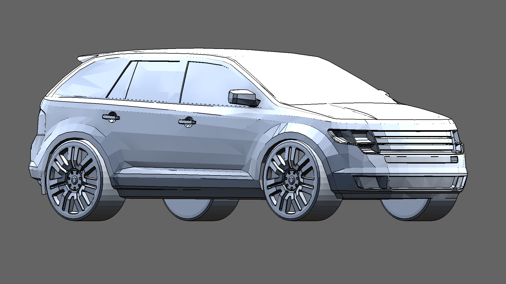

### Panel Van (**PanelVan**)

Based on the D3S MB Vito Panel Van (W447) 2015

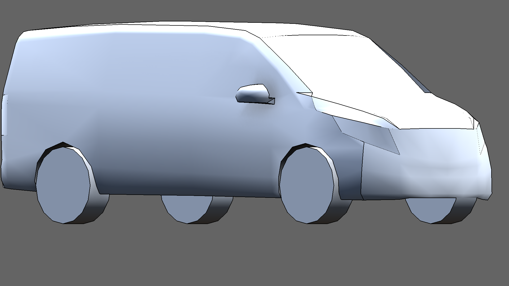

### Topless Convertible (**Topless**)

Based on the Chrysler Sebring Convertible

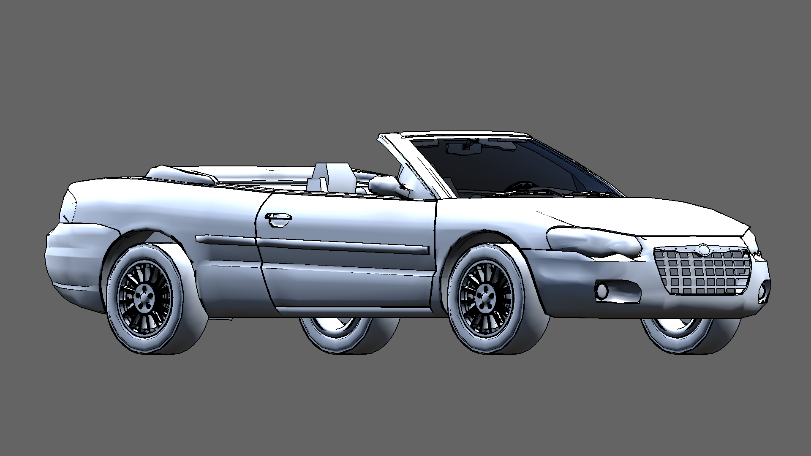

### Station Wagon (**StationWagon**)

Based on the 80s Lincoln Zephyr Mercury

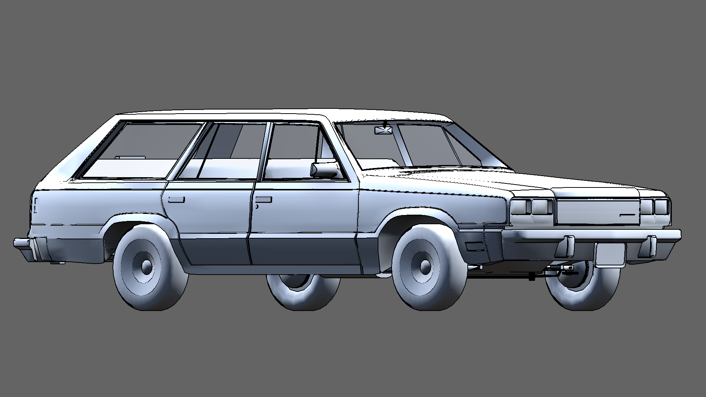

### Minibus (**Minibus**)

Based on the Peugeot J5

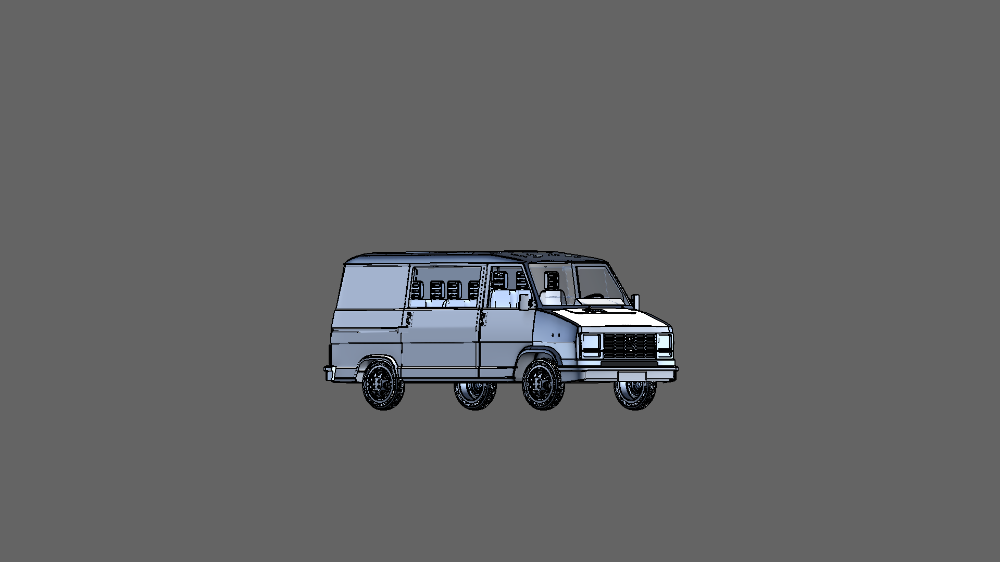

###

### Four wheel Truck (**FourWheel**)

Inspired by Japanese-made small-cabin commercial trucks from the 1990s.

### Pickup Truck (**Pickup**)

Based on the 2015 Ford F150 King Ranch Edition

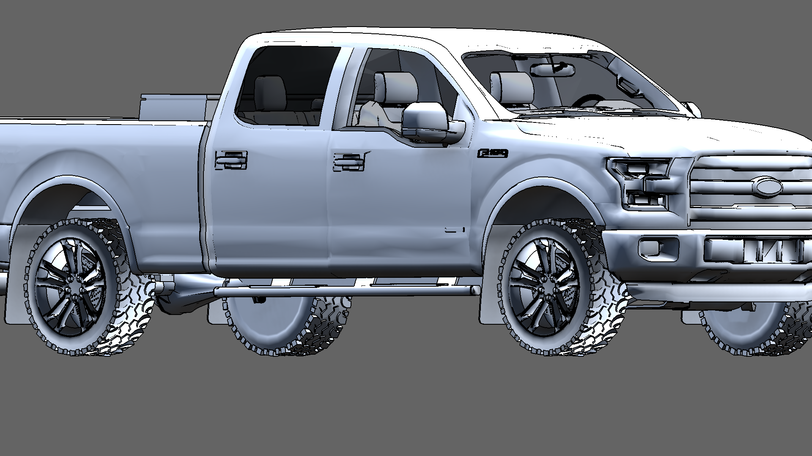

### Moving Truck (**MovingTruck**)

Non real life counterpart. Based on Japanese-made 2-door pickup-cabin box trucks.

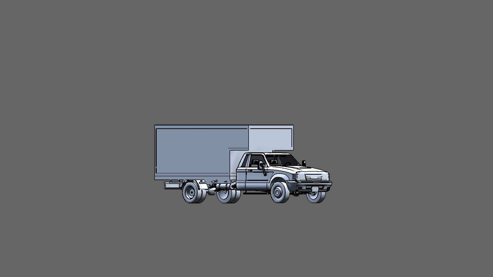

###

### Motor home (**Motorhome**)

Based on a non-specified GMC Motorhome.

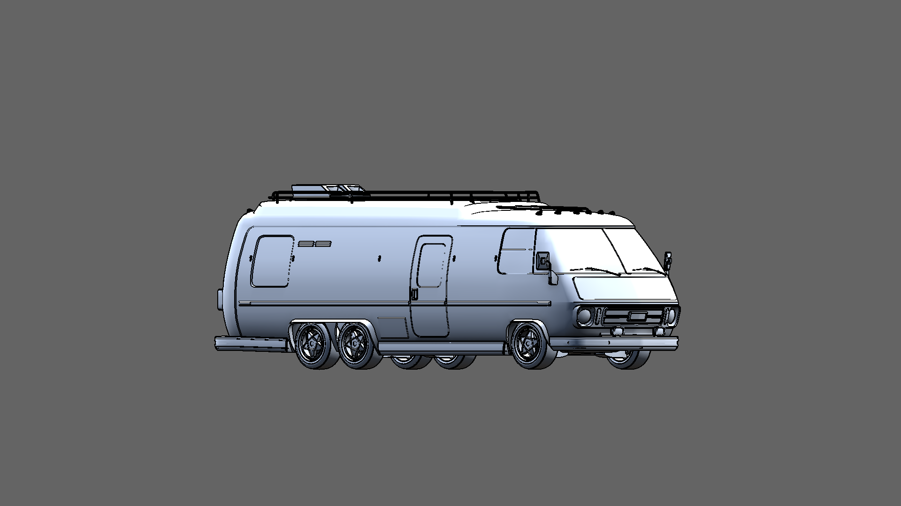

### Double Decker Bus (**DoubleDecker**)

Inspired by the Volvo B8L.

### Single Decker Bus (**SingleDecker**)

No specified real life counterpart.

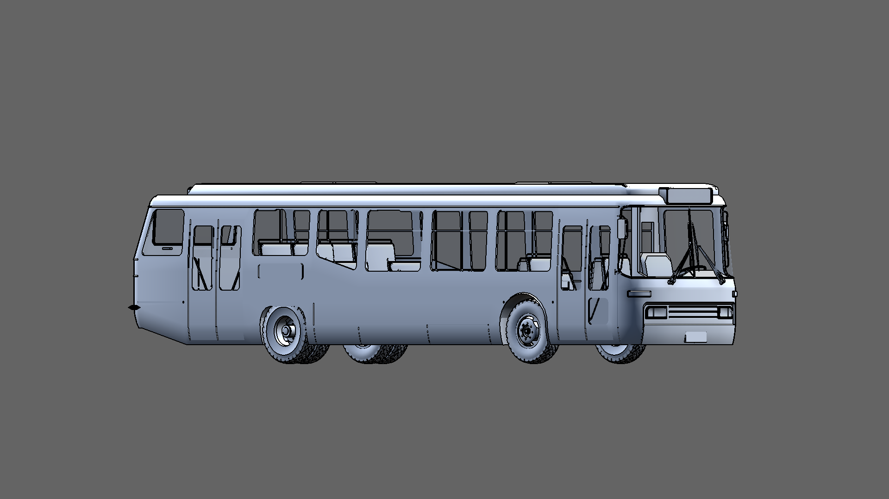

##

## (c) Target Vehicle Positions

Here you choose what positions you want to test the Target Vehicle in. You must list each position with a prefix corresponding to the _Position Distance_ selected in the _Setup ID_, separated by commas.

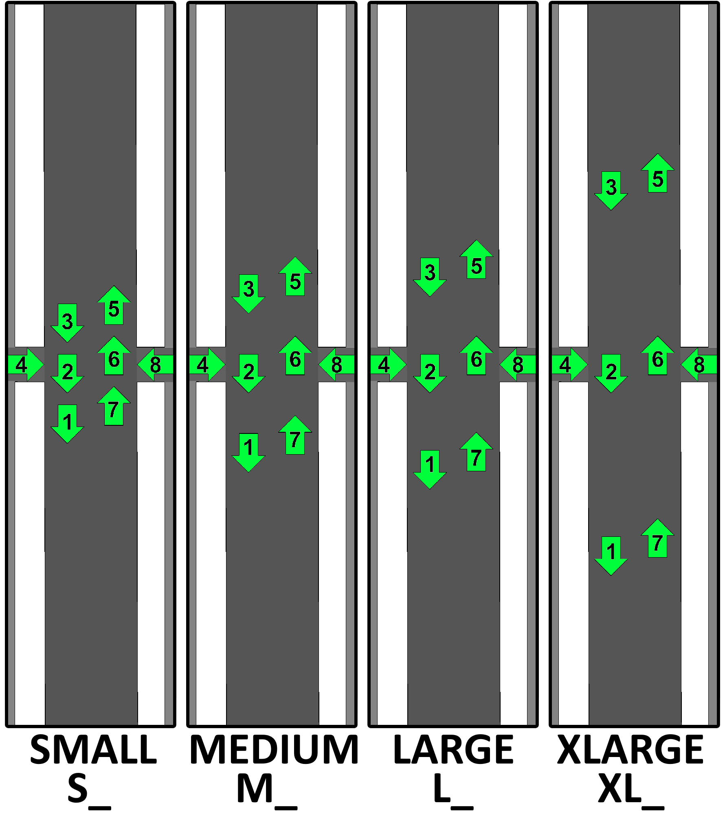

For example, if the distance is SMALL and the Target Vehicle may be found at position 3 and 5, then you should write "S_3,S_5"

##

## (d) Number of Vehicles in Simulation

The number of vehicles for this _Simulation Run_, including the _Target Vehicle_ and any _Blocking Vehicles_. This value should never be lower than 1 or higher than 8.

## (e) Blocking Vehicle Model

This lets you choose the 3D model of the _Blocking Vehicles_ on the road that may block the _Target Vehicle_. These vehicles do not capture any data, and just serve as visual obstacles. The available options for this element are the same as for the Target Vehicle Model.

## (f) Blocking Vehicle Positions

Here you choose what positions the Blocking Vehicles may be in, using the same structure as with the Target Vehicle Positions.

## (g) Camera Positions and Directions

Here you chose what are the _Camera Positions_ and _Camera Directions_ for this _Simulation Run_. During the simulation, the program will take _Data Captures_ at each _Camera Position_ and _Camera Direction,_ at five different heights. The structure of each specified position and direction is "\[Camera Position\]-\[Camera Direction 1\],\[Camera Direction 2\],...", separated by semicolons (;).

A Camera Position can be:

- A Pedestrian, in which case the ID for that position is the letter seen on the illustration on the right (e.g. G).
- A Vehicle, in which case the ID for that position is what it would be for the Target Vehicle Positions and the Blocking Vehicle Positions of this _Simulation Run_ (e.g. M_6).

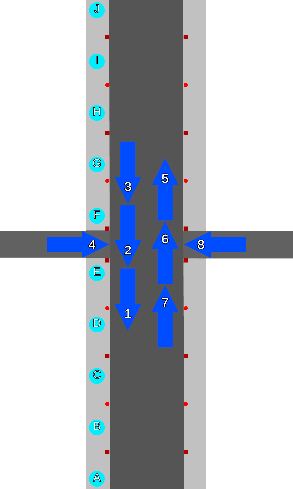

_Camera Directions_ are numbered 1 thru 8, starting from the East and going counterclockwise to the South-East, as in the following illustration

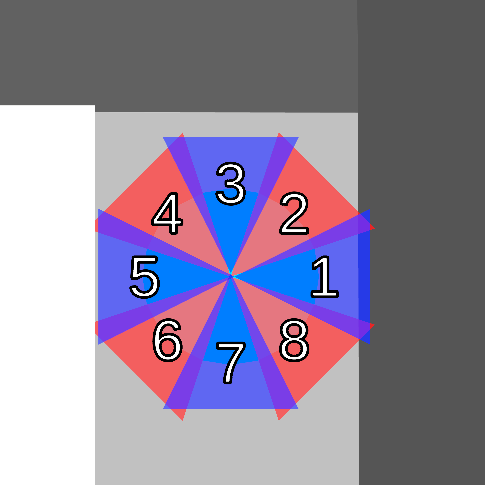

Each must be written following each position, separated by commas (e.g. M_7-2,7) will make it so the camera may be at the vehicle position 7, with medium distance from vehicle position 6, and take _Data Captures_ in the North and South directions.

## (h) Minimum Recording Distance

The minimum distance from the camera before a point is recorded in a _Data Capture_. Points closer to the camera will not be recorded. This does not prevent obstacle occlusion. The minimum number is 0, the maximum number is the Maximum Recording Distance.

## (i) Maximum Recording Distance

The maximum distance from the camera for a point to be recorded in a _Data Capture_. Points farther to the camera than this distance will not be recorded.The minimum value is the Minimum Recording Distance.